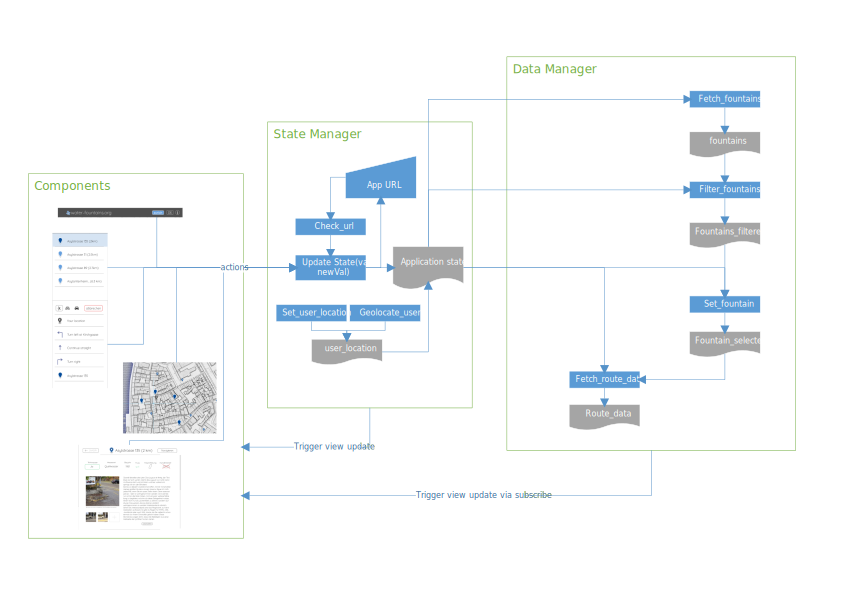

=====================
ProxiMap Architecture
=====================

-------------------------
State and Data Management
-------------------------
Application State and Data is managed by a service, the stateManager and dataManager. The flow of information is uni-directional:
Events trigger state changes which can trigger data changes (or not). The components watch the state and data for changes and react accordingly.

Open questions
--------------
- is Redux an appropriate architecture for the project?
- The full data weighs about 500k. Is that too big to include in a Redux store? What are workarounds?

